# 🍀 FriendlyLend App

FriendlyLend is a full-featured web application built with Spring Boot and Thymeleaf that allows users to lend and borrow clothes and accessories within a trusted, close-knit community. The app includes item management, favorite lists, user roles, and real-time integration with a separate REST microservice (`ecoSurvey-svc`). This service enables users to express their views on environmental topics such as sustainability, recycling, and pollution via interactive surveys.

---

## 🌱 About the Project

The platform is targeted at Generation Z – active, socially conscious, and digitally connected users who are looking for sustainable and alternative ways to engage with fashion.

FriendlyLend promotes reuse and sharing of fashion items, with every item available for a symbolic price of €1.

A key feature is the integration with an eco-awareness survey. Users can explore short, high-impact environmental themes like **SUSTAINABILITY**, **ENVIRONMENT**, and **RECYCLING** – and express their support with just one click.

---

## 🌍 Future Vision

- 💬 Users will be encouraged to meet in person to exchange items at convenient locations such as universities, cafés, or gyms – streamlining the process and avoiding delivery fees.

- 🎯 Future versions may include bidding, where certain items may go above the symbolic €1. Users whose fashion items are most desired and frequently borrowed will be recognized as trendsetters in the community.

---

## 🔔 Notifications & Scheduling

After registration, each user receives a default notification explaining that their items' activity is monitored. If an item remains unborrowed for more than 60 days, a scheduled task automatically sends a warning notification to the owner that the item may soon be archived.

This system helps maintain a clean and active item catalog on the platform.


## 🚀 Features

- 🧾 User registration and login with roles: `USER` and `ADMIN`
- 📦 Add, view, and remove items
- ❤️ Mark items as favorites
- 🌍 Integrated ecoSurvey via REST API
- 🔔 Notification system (auto-warnings for inactive items)
- 🕒 Scheduled tasks (check item activity every 60 days)
- 🛠️ Admin panel for managing users (activate/deactivate accounts and change roles)
- 🛒 Item purchase and delivery location modules
- 🧼 Global exception handling

---

## 🔗 Integration with `ecoSurvey-svc` (REST API)

This application connects to a separate REST API (`ecoSurvey-svc`) that allows users to express support for one of three key environmental topics directly from the FriendlyLend interface.

Users can choose to support one of the following:

- **SUSTAINABILITY** – Supporting smart fashion and conscious choices
- **ENVIRONMENT** – Raising awareness about plastic pollution and environmental impact
- **RECYCLING** – Promoting reuse and reducing textile waste

Each user may select **one topic** to support. Their vote is submitted via REST and stored in the ecoSurvey service, which maintains its own database.

Additionally, the FriendlyLend app retrieves **aggregated voting statistics** from the REST API. These results are **visible only to administrators**, and are displayed in the admin dashboard to provide insight into user support for each topic.


---

## 🛡️ Security

- Role-based access control with custom roles: `USER`, `ADMIN`
- Secure routes using `SecurityFilterChain` configuration
- Custom login/logout and protected endpoints
- `AuthenticationMetadata`: custom `UserDetails` implementation with UUID-based identification and role control
- Fine-grained authorization using `AuthorizationService`:
    - Only users or admins can access sensitive resources
- Method-level access with `@EnableMethodSecurity`

---

## 📂 Package Structure

```
app
├── config             # Spring and security configuration
├── deliveryLocation   # Delivery address logic
├── exception          # Global error handling
├── favorite           # Favorite items
├── item               # Item logic (CRUD)
├── notification       # Notifications
├── purchase           # Purchase logic
├── scheduled          # Scheduled tasks
├── security           # Spring Security implementation
├── survey             # REST client for ecoSurvey API
├── user               # User management and roles
└── web
    ├── dto            # Data Transfer Objects
    └── mapper         # Controllers and mappers
```

---

## 🧰 Tech Stack

- Java 21
- Spring Boot
- Spring MVC + Thymeleaf
- Spring Data JPA (Hibernate)
- Spring Security
- MySQL
- REST communication with `RestTemplate`
- Maven

---

## ⚙️ Installation & Run

1. Clone the repository:
   ```bash
   git clone https://github.com/your-username/friendly-lend-app.git
   cd friendly-lend-app
   ```

2. Configure your database credentials in `application-secret.properties` (this file is excluded via `.gitignore`):
   ```properties
   spring.datasource.username=your_user
   spring.datasource.password=your_password
   ```

3. Run the application:
   ```bash
   mvn spring-boot:run
   ```

4. Access in browser:
   ```
   http://localhost:8080
   ```

---

## 📸 Screenshots

### 🔐 Authentication

**Index Page (Welcome)**  
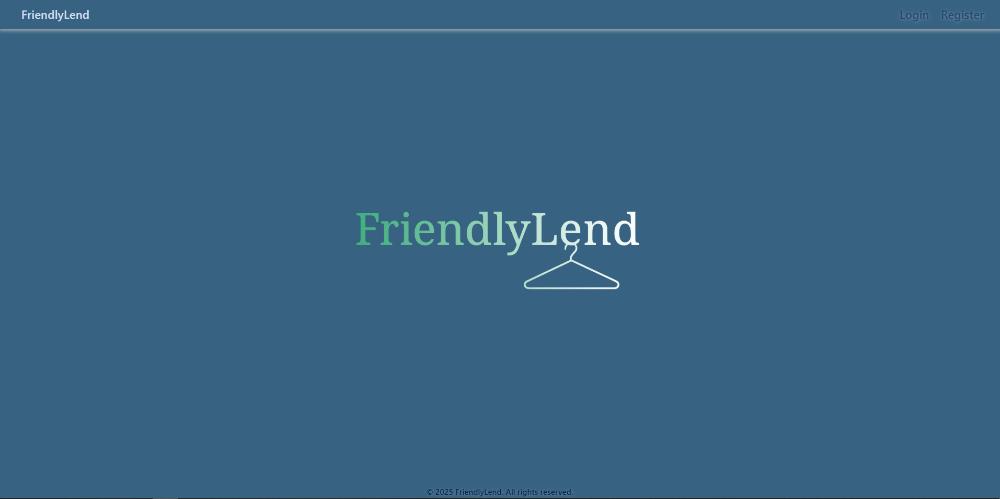

**Register Page**  
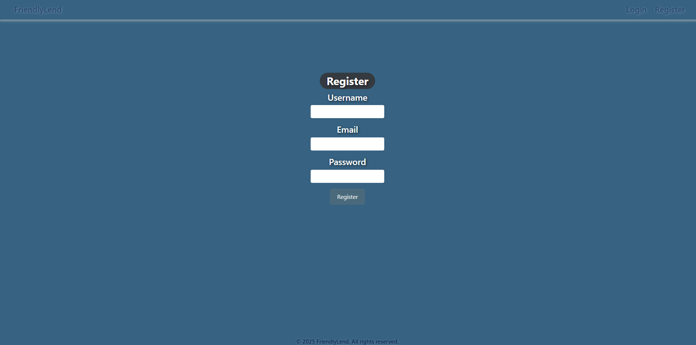

**Login Page**  
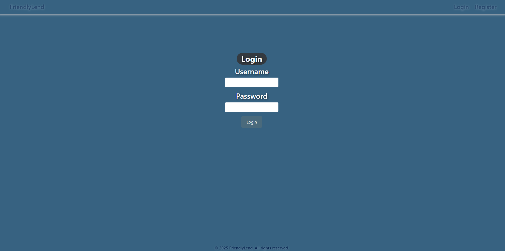

---

### 🏠 Home Pages

**User Home Page**  
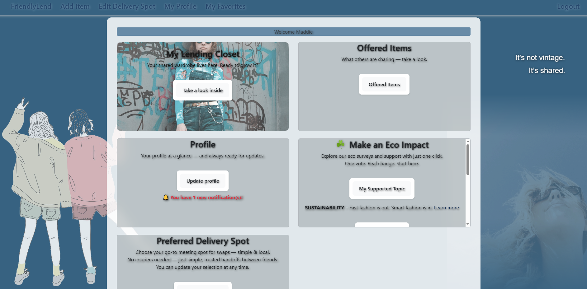

**Admin Home Page**  
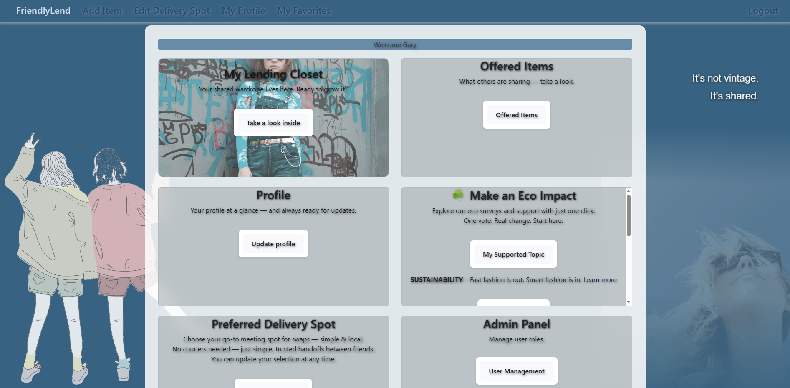

---

### 👤 Profile & Notifications

**Profile (Admin View)**  
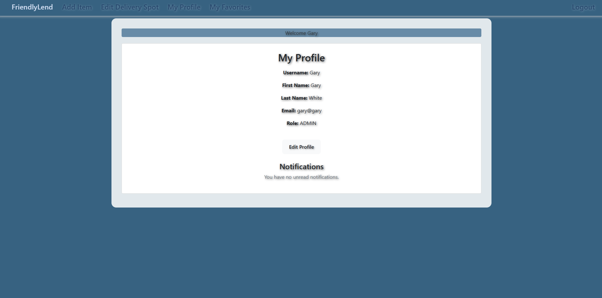

**Initial Notification in Profile**  
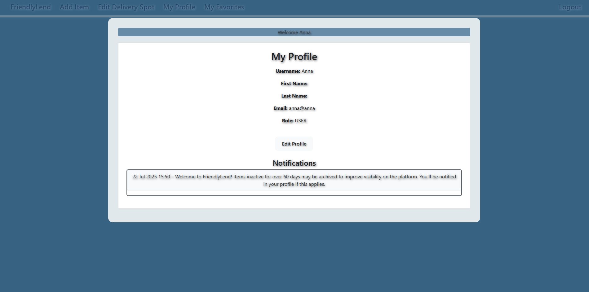

**Scheduled Inactivity Notification**  
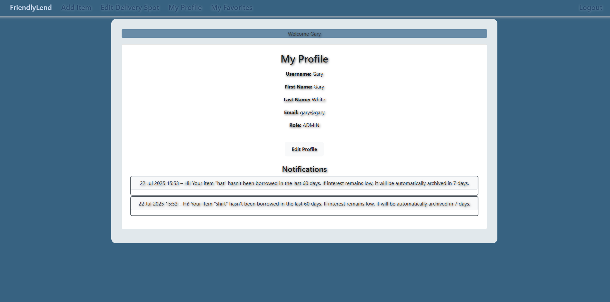

**Delivery Spot Preferences**  
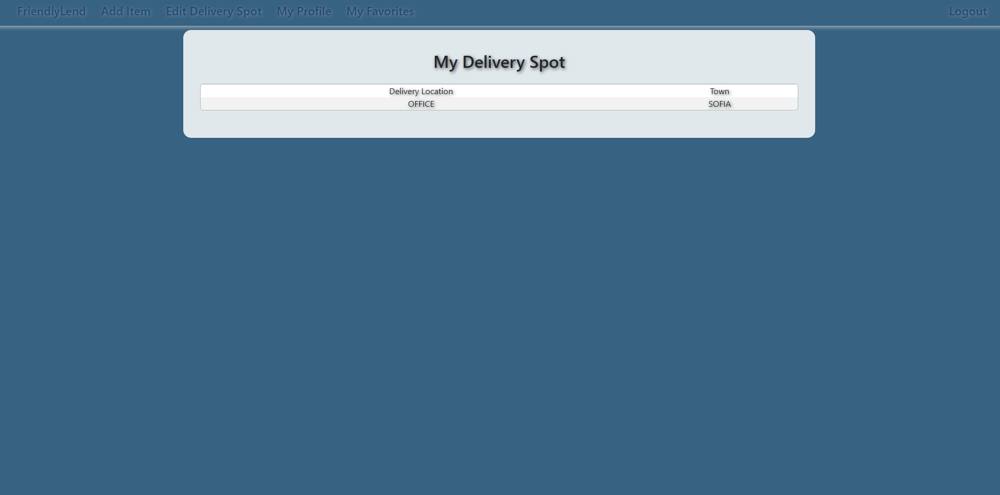

---

### 🧥 Item Management

**Add Item Form**  
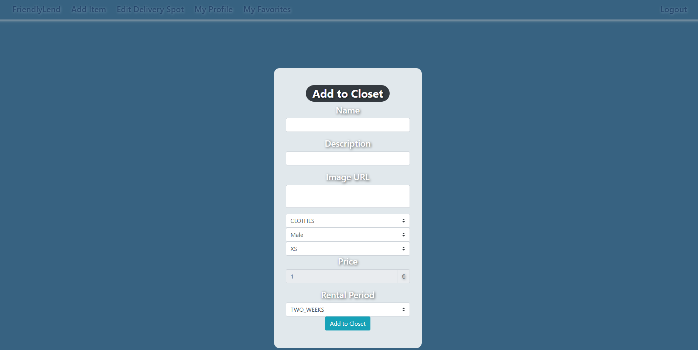

**Offered Items List**  
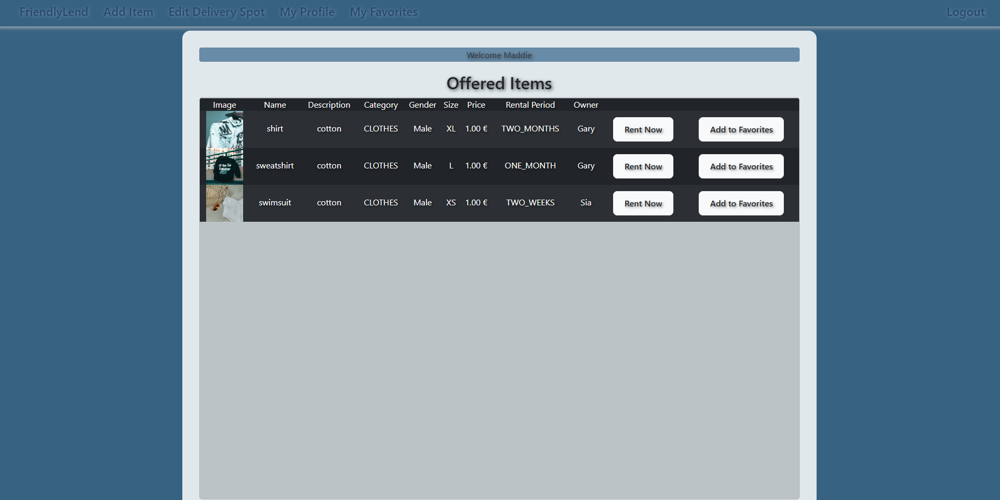

**Item Zoom Preview**  
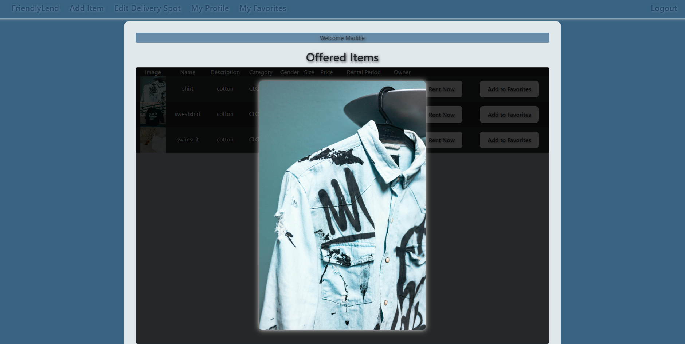

**Favorites Page**  
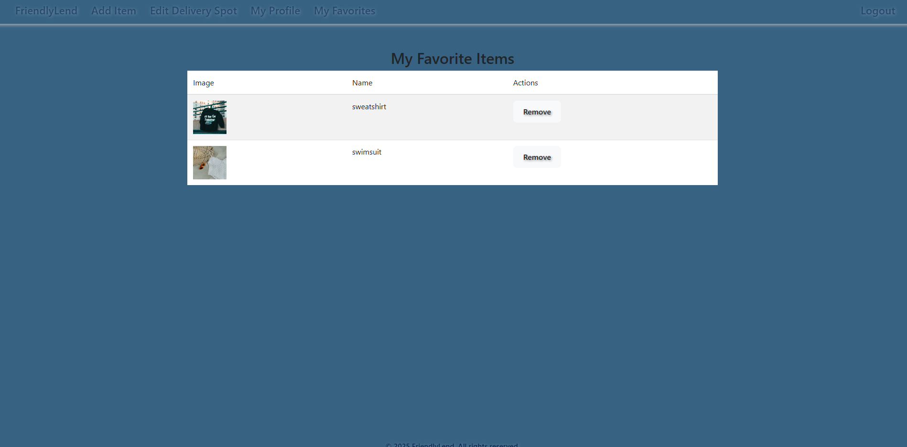

**My Closet Page**  
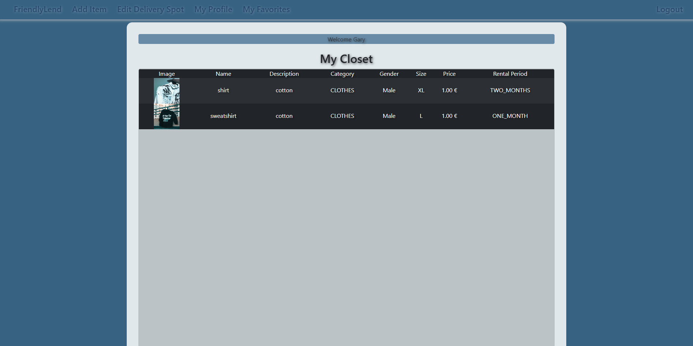

---

### 🌿 EcoSurvey

**Survey Confirmation Page**  
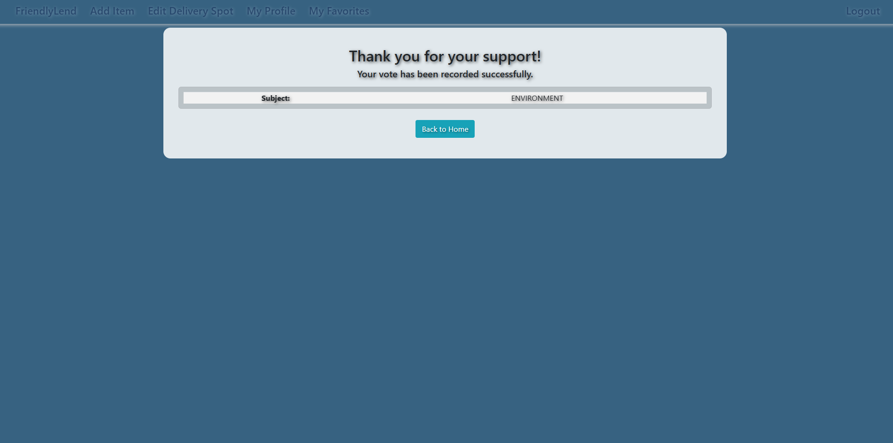

**My Eco Vote**  
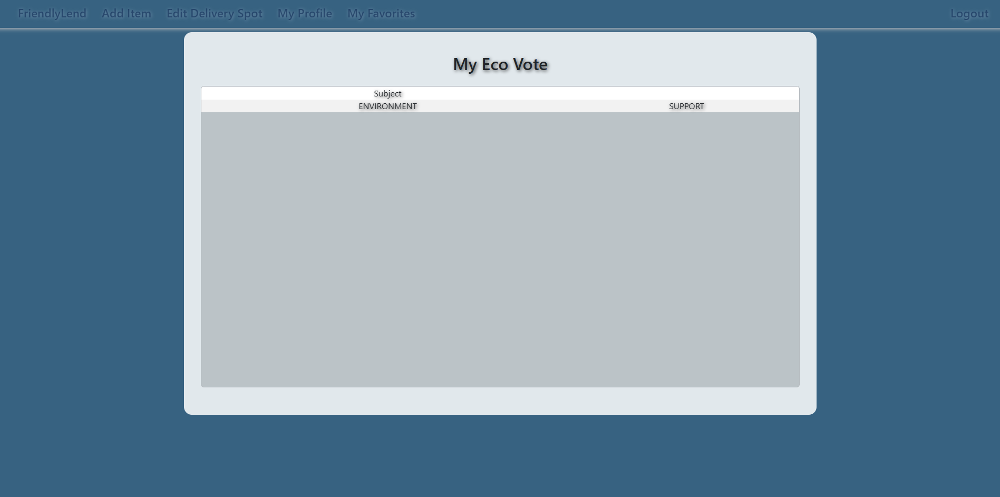

---

### ⚙️ Admin Panel

**User Management Page**  
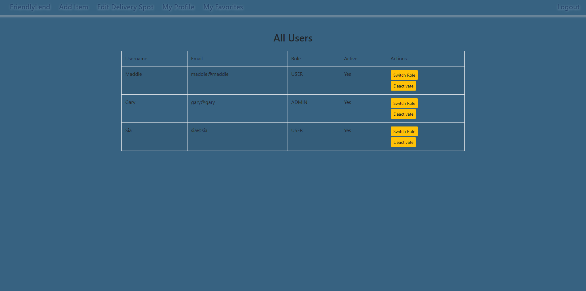

---

## 🛠️ Future Improvements

- Docker support in a separate development branch
- Swagger / OpenAPI documentation
- CI/CD with GitHub Actions
- Pagination and filtering on item lists
- Enhanced UI/UX (theme, mobile support)

---

## 👩‍💻 Author

Developed as a final project in the Spring Advanced course at SoftUni (2025).

---

## 📄 License

This project is licensed under the MIT License - see the [LICENSE](LICENSE) file for details.
